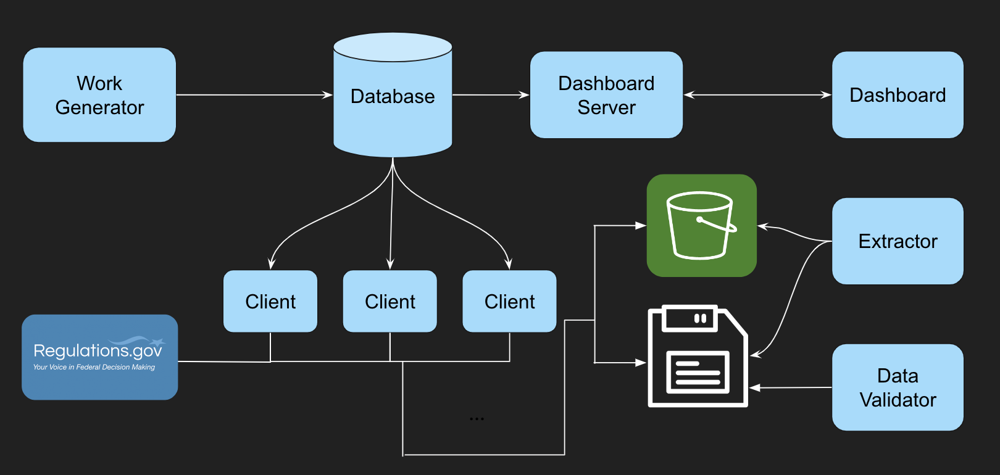

# Mirrulations

Software to create and maintain a mirror of regulations.gov.

## Architecture
The image below shows the overview of the architecture for our system. It shows the relationship between components and how they are used in the system.

#### Regulations.gov
------
The data on [Regulations.gov](https://www.regulations.gov) consists of Congressional laws that have been passed and implemented as regulations by federal agencies. The site is available to the public such that anyone can read and provide feedback for these regulations to make their opinions known.

#### The Problem
------

The way that Regulations.gov is currently set up, users may search for and comment on regulations on the main site. However, finding older regulations through the site's API has become a more difficult and limited process where users must apply for an API key to be granted time-limited access to larger sets of data.

The reason users must apply for an API key is because Regulations.gov has taken steps toward conserving their system resources by limiting how many times per hour a user can query the API. This came about after late-show host, John Oliver, called attention to the [fight for net neutrality](https://www.cbsnews.com/news/john-oliver-fans-flood-fcc-website-in-fight-for-net-neutrality/) in 2017 where a flood of viewers crashed the FCC's website with their comments. In an effort to reduce the overall traffic, API access is now limited to one account per organization as well and requires an approval process to validate API keys.

#### The Objective
------

The objective of the Mirrulations project is to make the data on Regulations.gov more easily accessible to the public by acting as a mirror to the site. Since it is federal data, it must be available (with exceptions) to the public under the [Freedom of Information Act](https://foia.state.gov/Learn/FOIA.aspx). By making the data readily available in one place, analysts can more easily study it.

#### The Solution
------
The Mirrulations project endeavors to create a mirror of the regulatory data on Regulations.gov to make it more accessible to the general public. Our goal is to collect all of the data from the site and store it in a database/cloud for users to search for at their leisure. The only problem with that is that there are currently over 9.6 million regulations documents (and counting!) to be downloaded.

With the API limiting that is in place, it would take us months to download all of the data by ourselves, so we are creating a volunteer computing system that allows other people to contribute to the expedition of the downloading process. Through this project users can apply for an API key and volunteer their computer's CPU for downloading data and sending it to our server. If you choose to volunteer, the instructions below will help you to help us get up and running.

## Getting Started

If you are interested in becoming a developer, see `docs/developers.md`.

To run Mirrulations, you need Python 3.9 or greater ([MacOSX](https://docs.python-guide.org/starting/install3/osx/) or [Windows](https://docs.python-guide.org/starting/install3/win/)) on your machine to run this, as well as [redis](https://redis.io/) if you are running a server

You will also need a valid API key from Regulations.gov to participate. To apply for a key, you must simply [contact the Regulations Help Desk](regulations@erulemakinghelpdesk.com) and provide your name, email address, organization, and intended use of the API. If you are not with any organizations, just say so in your message. They will email you with a key once they've verified you and activated the key.

To download the actual project, you will need to go to our [GitHub page](https://github.com/MoravianUniversity/mirrulations) and [clone](https://help.github.com/articles/cloning-a-repository/) the project to your computer.

### Disclaimers
--------
"Regulations.gov and the Federal government cannot verify and are not responsible for the accuracy or authenticity of the data or analyses derived from the data after the data has been retrieved from Regulations.gov."

In other words, "once the data has been downloaded from Regulations.gov, the U.S. Government cannot verify and is not responsible for the quality, accuracy, reliability, or timeliness of any analyses conducted using the downloaded data."

This product uses the Regulations.gov Data API but is neither endorsed nor certified by Regulations.gov.

--------
This project is currently being developed by a student research team at Moravian University

## Contributors

#### 2023
* [Alexander Flores-Sosa](https://www.linkedin.com/in/alexflore301/) 
* [Bryan Cohen](https://www.linkedin.com/in/bryan-cohen-642374253/) 
* [Edgar Perez](https://www.linkedin.com/in/edgar-perez-245269191/) 
* [Edwin Cojitambo](https://www.linkedin.com/in/edwin-cojitambo-744334222/?trk=people-guest_people_search-card) 
* [Evan Toyberg](https://www.linkedin.com/in/evantoyberg/) 
* Jack Wagner (wagnerj05@moravian.edu)
* [Justin Szaro](https://www.linkedin.com/in/justinszaro/) 
* [Kyle Smilon](https://www.linkedin.com/in/kyle-smilon-aa362b212/) 
* [Nikolas Kovacs](https://www.linkedin.com/in/nikolas-kovacs/) 
* [Reed Sturza](https://www.linkedin.com/in/reed-sturza/) 
* [Tanishq Iyer](https://www.linkedin.com/in/tanishqiyer/) 
* [Tyler Valentine](https://www.linkedin.com/in/tyler-valentine-026104219/) 

#### 2022

* [Abdullah Alramyan](https://www.linkedin.com/in/abdullah-alramyan-1b1b56113/) 
* [Valeria Aguilar](https://www.linkedin.com/in/valeria-aguilar-395479222/) 
* [Jack Fineanganofo](https://www.linkedin.com/in/jackbf/) 
* [Richard Glennon](https://www.linkedin.com/in/glennonr/) 
* [Eric Gorski](https://www.linkedin.com/in/eric-gorski-5a7888197/) 
* [Shane Houghton](https://www.linkedin.com/in/shane-houghton-b4b0a41a2/) 
* [Benjamin Jones](https://www.linkedin.com/in/benjamin-jones-bb9533229/) 
* [Matthew Kosack](https://www.linkedin.com/in/matthew-kosack-517835173/) 
* [Cory Little](https://www.linkedin.com/in/cory-little/) 
* Michael Marchese (marchesem@moravian.edu)
* [Kimberly Miller](https://www.linkedin.com/in/kimberly-miller-39b31a162/) 
* [Mark Morykan](https://www.linkedin.com/in/mark-morykan-a64605189/) 
* [Robert Rabinovich](https://www.linkedin.com/in/robert-rabinovich-8412591a2/) 
* [Maxwell Schuman](https://www.linkedin.com/in/maxwell-schuman-98276020a/) 
* Elizabeth Vincente (vincentee@moravian.edu)
* [Kimberly Wolf](https://www.linkedin.com/in/wolfkimberly/) 
* [Isaac Wood](https://www.linkedin.com/in/isaac-wood-615a09154/) 

#### 2021

* Abdullah Alharbi (alharbia02@moravian.edu)
* [Alex Meci](https://www.linkedin.com/in/alexander-meci-292954183/) 
* [Colby Hillman](https://www.linkedin.com/in/hillman-colby3521/) 
* [Emily Heiser](https://www.linkedin.com/in/emily-heiser-6b76601a1/) 
* [Francis Severino-Guzman](https://www.linkedin.com/in/francisseverino/) 
* [Jarod Frekot](https://www.linkedin.com/in/jarod-frekot-04573b183/) 
* [John Lapatchak](https://www.linkedin.com/in/john-lapatchak-jr-236b1b184/) 
* [Jonah Beers](https://www.linkedin.com/in/jonahbeers/) 
* [Jorge Aguilar](https://www.linkedin.com/in/jorge-aguilar-129210180/) 
* [Juan Giraldo](https://www.linkedin.com/in/juan-giraldo-795559187/?trk=people-guest_people_search-card) 
* [Kylie Norwood](https://www.linkedin.com/in/kylie-norwood-11b466180/) 
* [Larisa Fava](https://www.linkedin.com/in/larisa-fava-737ab6214/) 
* [Riley Kirkpatrick](https://www.linkedin.com/in/riley-kirkpatrick/) 
* [Trae Freeman](https://www.linkedin.com/in/traefreeman/) 
* [William Brandes](https://www.linkedin.com/in/william-brandes-516013180/) 

#### 2020

* [Alghamdi Riyad](https://www.linkedin.com/in/riyad-alghamdi/?originalSubdomain=sa) 
* [Anderson Ben](https://www.linkedin.com/in/banderson6895/) (andersonb03@moravian.edu)
* [Dahdoh Sara](https://www.linkedin.com/in/sara-dahdoh-789b78172/) 
* [Estephan Anthony](https://www.linkedin.com/in/anthony-estephan-4693841a2/) 
* [Faux Timothy](https://www.linkedin.com/in/timothy-faux/) 
* [Hilal Abrar](https://www.linkedin.com/in/abrar-hilal-47b357207/) 
* [Ives Elijah](https://www.linkedin.com/in/elijah-ives-4110761a3/) 
* [McCool Caelin](https://www.linkedin.com/in/caelin-mccool-110261180/) 
* [Piya Nischal](https://www.linkedin.com/in/nischalpiya/) 
* [Rajhi Somaya](https://www.linkedin.com/in/somaya-rajhi-7b1b66173/) 
* [Schmall Kiersten](https://www.linkedin.com/in/kierstenschmall9/) 
* Wang Yuwen (wang@moravian.edu)

#### 2019

* [Balga Zachary](https://www.linkedin.com/in/zachary-balga-52b07a137/) 
* [Edwards Manasseh](https://www.linkedin.com/in/manasseh-edwards/) 
* [Harbison Ed](https://www.linkedin.com/in/edwharbison/) 
* [Haug Alex](https://www.linkedin.com/in/alexander-haug-024396137/) 
* [Mateo Lauren](https://www.linkedin.com/in/lauren-mateo-8a6821159/) 
* Murphy Timothy (sttam09@moravian.edu)
* [Spirk John](https://www.linkedin.com/in/john-spirk-iii/) 
* [Stocker Daniel](https://www.linkedin.com/in/daniel-stocker-453936159/) 

## Faculty
* Ben Coleman (colemanb@moravian.edu)
